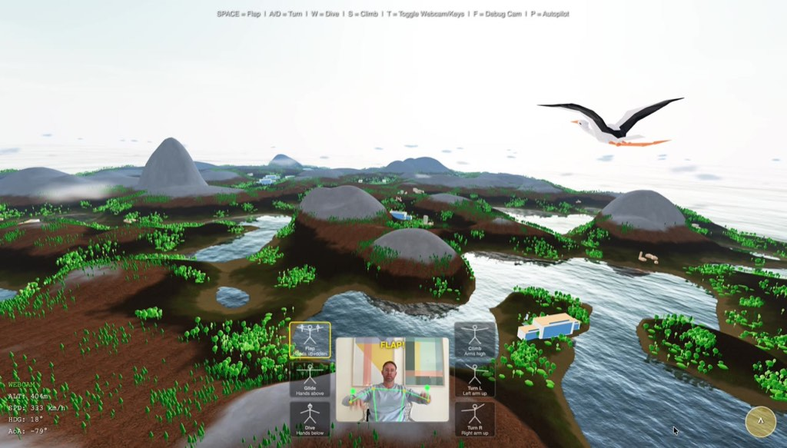
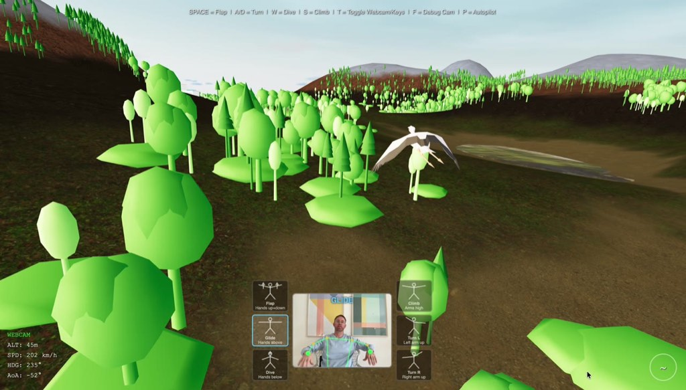
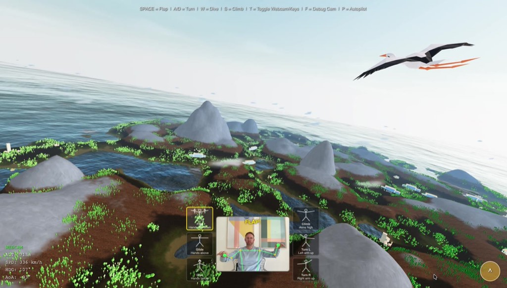
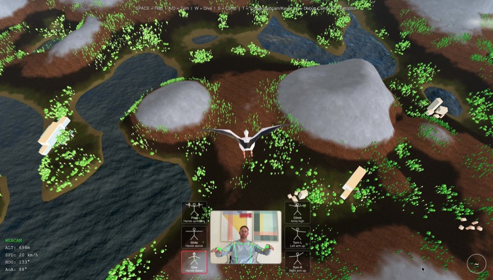
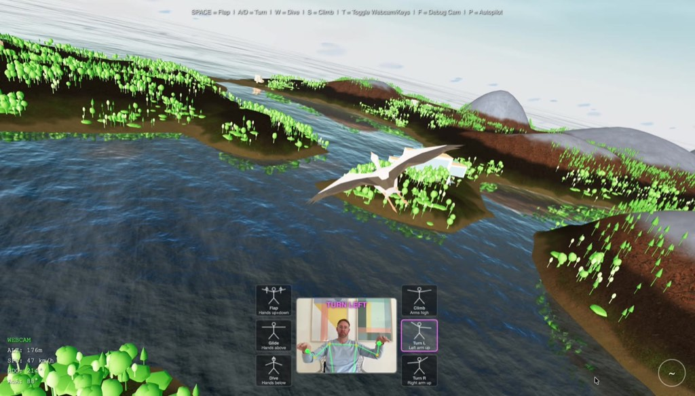
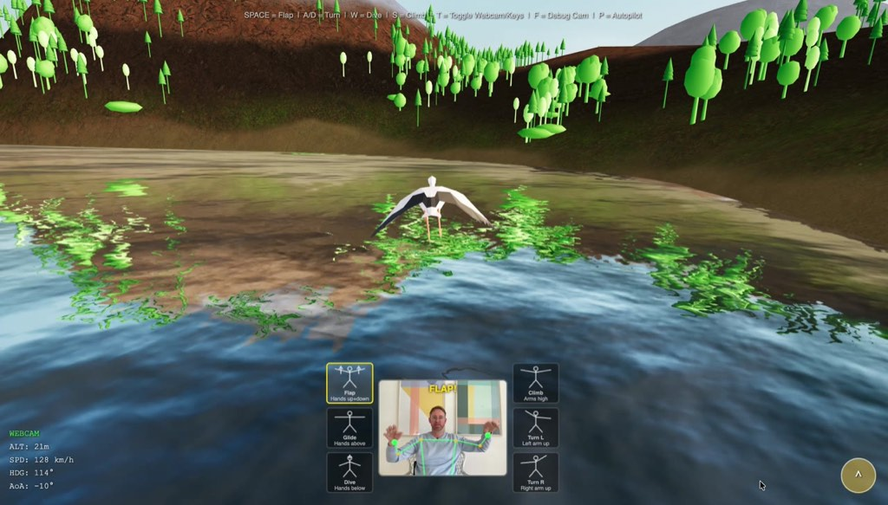
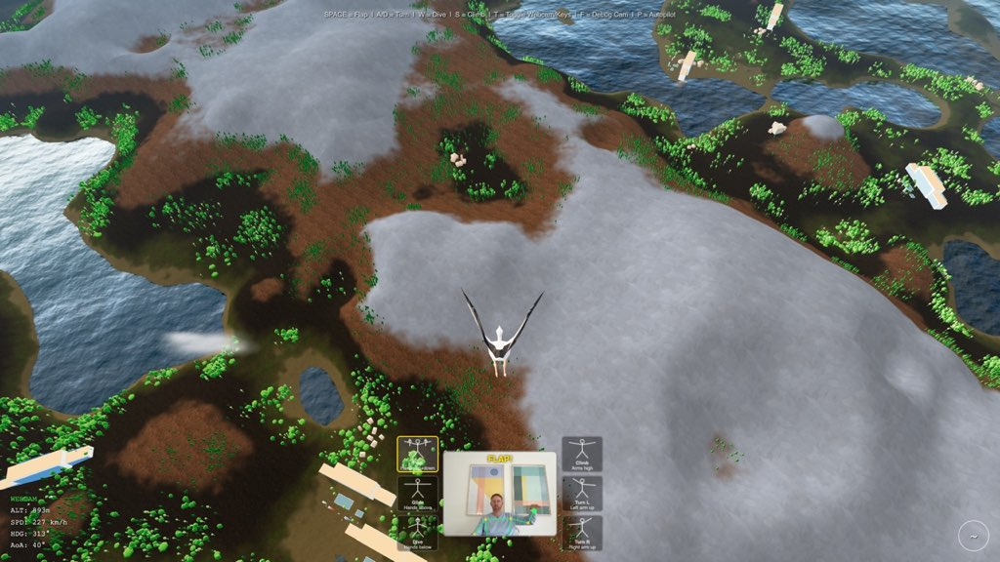

# 🦅 VogelSimulator — Flap Your Arms to Fly

[](https://github.com/pmmathias/VogelSimulator)
[](LICENSE)
[](https://threejs.org/)
[](https://mediapipe.dev/)
[](https://ki-mathias.de/vogelsimulator.html)

**A browser-based 3D bird flight simulator with real-time webcam gesture control.** Flap your arms to gain altitude, spread them to glide, tuck them to dive — all tracked via your webcam. No installation needed beyond `npm install`.

**[Play now in your browser](https://pmmathias.github.io/VogelSimulator/)** — no install required, works on desktop and mobile.

> 📖 **Read the full story:** [How we built a gesture-controlled bird flight simulator with AI](https://ki-mathias.de/vogelsimulator.html) — development blog with behind-the-scenes insights, architecture decisions, and lessons learned.



## Gallery

| | |
|---|---|
|  |  |
| *Flying through 3D forests with webcam gesture control* | *Stork gliding along the coast with snow-capped mountains* |
|  |  |
| *Bird's eye view: hotels, lakes, forests, and mountains* | *Skimming the coastline at low altitude* |
|  |  |
| *Stork gliding just above the water surface* | *Diving toward the island at high speed* |

## Features

- **Webcam Gesture Control** - Flap your arms to gain altitude, spread them to glide, tuck them to dive
- **Keyboard Fallback** - Full flight control via keyboard (Space, WASD)
- **Aerodynamic Physics** - Lift, drag, angle of attack, wing incidence, and gravity simulation
- **Procedural Island World** - Parabolic arc terrain with 5 texture layers (sand, grass, earth, rock, snow)
- **Underwater Diving** - Dive below the water surface to see fish and coral reefs
- **Dynamic Sky** - Procedural sky with sun, clouds at mountain height, environment reflections
- **Speed Rush FOV** - Field of view widens during high-speed dives
- **Autopilot Demo** - Scripted flight sequences for showcasing

## Quick Start

```bash
# Install dependencies
npm install

# Start development server
npm run dev

# Open in browser
open http://localhost:5173
```

Press **F** to enter flight mode (or it starts automatically in flight mode).

## Controls

### Keyboard Mode

| Key | Action |
|-----|--------|
| **Space** | Flap wings (gain altitude) |
| **A / D** | Turn left / right |
| **W** | Dive (tuck wings) |
| **S** | Climb (spread wings + lean back) |
| *No key* | Glide (gentle descent) |

### Webcam Gesture Mode

| Gesture | Action |
|---------|--------|
| Arms flapping up & down | Flap (gain altitude) |
| Arms spread horizontally | Glide |
| Arms raised above head | Climb |
| Arms tucked at sides | Dive |
| One arm higher than other | Bank turn |

### Toggle Keys

| Key | Function |
|-----|----------|
| **T** | Toggle between Keyboard / Webcam mode |
| **F** | Toggle debug orbit camera |
| **P** | Start/stop autopilot demo |
| **C** | Recalibrate webcam pose |
| **R** | Regenerate world (debug mode only) |

## Tech Stack

- **[Three.js](https://threejs.org/)** - 3D rendering engine
- **[MediaPipe](https://mediapipe.dev/)** - Real-time pose detection from webcam
- **[Vite](https://vitejs.dev/)** - Build tool and dev server
- **[Playwright](https://playwright.dev/)** - Automated browser testing

## Project Structure

```
src/
  main.js                  # Entry point, game loop orchestration
  constants.js             # All tunable parameters (physics, world, camera)

  core/
    Renderer.js            # WebGL renderer setup
    Scene.js               # Sky, lighting, fog, environment map
    GameLoop.js            # RAF-based update loop with delta clamping
    InputManager.js        # Keyboard/webcam input abstraction
    Autopilot.js           # Scripted flight sequences

  flight/
    FlightState.js         # Position, velocity, orientation state
    FlightPhysics.js       # Aerodynamic simulation (lift, drag, gravity)
    CameraRig.js           # Third-person chase camera with FOV effects

  pose/
    WebcamManager.js       # getUserMedia webcam access
    PoseDetector.js        # MediaPipe PoseLandmarker wrapper
    ArmAnalyzer.js         # Gesture recognition from arm positions

  world/
    WorldBuilder.js        # Orchestrates terrain, water, trees, buildings
    Terrain.js             # Parabolic arc heightfield + heightmap cache
    TerrainShader.js       # Custom 5-layer height-based texture blending
    TreeCluster.js         # Procedural tree billboard textures (4 species)
    ForestPlacer.js        # Noise-based forest distribution
    HousePlacer.js         # Building placement with forest/settlement zoning
    WaterPlane.js          # Reflective water surface
    CloudPlane.js          # Cloud sprite layer
    Underwater.js          # Fish, coral, underwater fog effects

  spatial/
    Octree.js              # Spatial partitioning for frustum culling
    OctreeNode.js          # Octree node implementation
    FrustumCuller.js       # Camera frustum visibility culling

  ui/
    HUD.js                 # Flight telemetry overlay (altitude, speed, heading)
    WebcamOverlay.js       # Gesture guide with stick figures + camera feed
    DebugPanel.js          # lil-gui debug controls (inactive)

  utils/
    math.js                # clamp, lerp, remap, angleBetween, randomRange
    noise.js               # FBM noise for terrain/forest distribution

scripts/
  screenshot.mjs           # Playwright automated visual testing
```

## World Generation

The terrain is generated using **parabolic arcs** - random dome-shaped height contributions that overlap to create natural-looking hills and valleys.

- **900 base arcs** with radius 60-600m and height 3-50m
- **30% negative arcs** carve valleys and lake beds
- **10-16 landmark peaks** with height 100-220m (with snow caps)
- **Radial island falloff** - terrain sinks below water at edges

### Terrain Textures (5 layers)

| Layer | Height | Texture |
|-------|--------|---------|
| Sand | Water level - 23m | Warm yellow sandy gravel |
| Grass | 23 - 45m | Green leafy grass |
| Earth | 45 - 65m | Brown forest ground |
| Rock | 65 - 95m | Grey cracked boulder |
| Snow | 95m+ | Bright white (75% white + 25% texture) |

Textures are blended using procedural FBM noise to break up uniform height bands. Steep slopes override to rock texture regardless of height.

All terrain textures from [Poly Haven](https://polyhaven.com/) (CC0 license).

## Flight Physics

The aerodynamic model simulates:

- **Lift** proportional to speed squared and effective wing area
- **Baseline lift** from wing incidence angle (enables stable glide)
- **Drag** (parasitic + induced) opposing velocity
- **Gravity** (-9.81 m/s²)
- **Flap thrust** - timed downstroke force (150N for 0.3s)
- **Wing tuck nosedive** - redirects horizontal velocity downward with extra gravity
- **Underwater physics** - strong water drag + buoyancy when below water level
- **Speed-dependent FOV** - subtle camera widening at high speed

### Bird Parameters

| Parameter | Value |
|-----------|-------|
| Mass | 3.5 kg |
| Wing area | 0.7 m² |
| Max speed | 100 m/s (360 km/h) |
| Terminal velocity | -80 m/s |
| Flap thrust | 150 N |
| Glide ratio | ~8:1 at cruise speed |

## Gesture Recognition

The webcam gesture system uses **MediaPipe PoseLandmarker** to detect arm positions:

1. **Arm elevation** (wrist Y relative to shoulder Y) determines wing spread
2. **Elevation amplitude** over 20 frames detects flapping
3. **Arm elevation difference** (left vs right) controls banking
4. **Dive intent** requires sustained low wing spread (5+ frames) with hysteresis

Robustness features:
- Graceful degradation when landmarks are lost (fade to glide)
- One-arm mirroring when only one arm is visible
- Flap suppresses pitch (arm movement doesn't cause false nose-down)
- 300ms flap hysteresis bridges gaps between strokes

## Automated Testing

```bash
# Install Playwright browser
npx playwright install chromium

# Run visual test (takes screenshots during autopilot flight)
node scripts/screenshot.mjs
```

The test script uses Playwright to:
1. Launch the app in Chromium with WebGL
2. Start an autopilot sequence
3. Capture screenshots at key moments (dive, turn, overview)
4. Log flight telemetry (altitude, speed, AoA)

## Performance

- **Heightmap cache** in localStorage - first load generates 512x512 grid, subsequent loads are instant
- **InstancedMesh** for trees (~100K+), buildings (~800), fish (5000), coral (5000)
- **Frustum culling** via octree spatial partitioning
- **Chunked terrain** (8x8 grid) for visibility management
- Terrain generates in ~400ms, full world in ~500ms (cached)

Press **R** in debug mode to regenerate the world with a new random seed.

## Building for Production

```bash
npm run build
# Output in dist/
```

The production build is a single HTML file + JS bundle. No backend required - runs entirely in the browser.

## License

Terrain textures from [Poly Haven](https://polyhaven.com/) - CC0 (public domain).

Building textures from [Poly Haven](https://polyhaven.com/) - CC0 (public domain).

## Credits

Built with [Claude Code](https://claude.ai/claude-code) (Anthropic Claude Opus 4.6).

## Blog & Documentation

- **Project Blog Post:** [VogelSimulator — Gesture-controlled bird flight simulator](https://ki-mathias.de/vogelsimulator.html)
- **AI & Technology Blog:** [ki-mathias.de](https://ki-mathias.de/) — Insights on AI-assisted software development
- **GitHub Repository:** [pmmathias/VogelSimulator](https://github.com/pmmathias/VogelSimulator)
